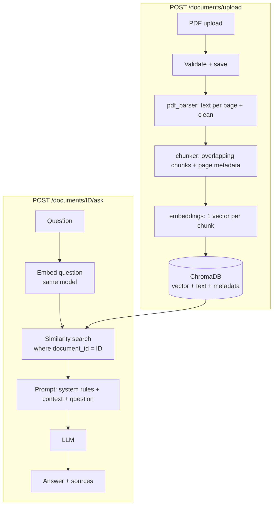

# PDF Q&A (RAG backend)

A small FastAPI backend: upload a PDF, then ask questions that are answered **only from that PDF**, with the retrieved chunks returned as sources. No LangChain, no agents. The whole pipeline is readable in a few files:

**parse → chunk → embed → store → retrieve → generate**

> Key idea: a vector represents **one chunk**, never the whole PDF. A PDF with 40 chunks has 40 vectors.

## Architecture



## Request flow

**Upload**: check extension, size and `%PDF-` header → save as `data/uploads/<uuid>.pdf` → extract text per page (blank pages skipped, page numbers kept) → chunk each page → embed all chunks in batches → store in Chroma with metadata `{document_id, filename, page, chunk_index, num_pages, created_at}`.

**Ask**: check the document exists → embed the question with the same embedding model → query Chroma with `where={"document_id": id}` → build the prompt → call the LLM → return the answer plus the retrieved chunks.

## Project structure

```
app/
  main.py                 FastAPI app, logging, /health
  api/deps.py             vector-store dependency
  api/routes/documents.py POST /documents/upload, GET /documents/{id}
  api/routes/qa.py        POST /documents/{id}/ask
  core/config.py          settings from env vars
  schemas/                Pydantic request/response models
  services/
    pdf_parser.py         PyMuPDF, page-by-page text + cleaning
    chunker.py            deterministic overlapping chunker
    embeddings.py         batched embedding calls
    vector_store.py       ChromaDB wrapper (filter by document_id)
    qa.py                 prompt building, retrieval, LLM call
tests/                    unit tests (mocked AI) + optional integration test
data/                     runtime data (git-ignored): uploads/, chroma/
```

## Environment variables

| Variable | Default | Purpose |
|---|---|---|
| `OPENAI_API_KEY` | – (required) | LLM key (and embeddings key unless overridden) |
| `OPENAI_BASE_URL` | OpenAI | Any OpenAI-compatible endpoint |
| `EMBEDDING_API_KEY` / `EMBEDDING_BASE_URL` | fall back to above | Use a different provider for embeddings |
| `LLM_MODEL` | `gpt-4o-mini` | Chat model |
| `EMBEDDING_MODEL` | `text-embedding-3-small` | Embedding model |
| `CHROMA_PATH` | `data/chroma` | Vector DB directory |
| `UPLOAD_DIR` | `data/uploads` | Saved PDFs |
| `CHUNK_SIZE` / `CHUNK_OVERLAP` | `1000` / `200` | Characters. Overlap must be < size |
| `TOP_K` | `4` | Chunks retrieved per question |
| `MAX_UPLOAD_MB` | `20` | Upload size limit |
| `EMBEDDING_BATCH_SIZE` | `64` | Texts per embedding request |
| `LOG_LEVEL` | `INFO` | Logging level |

### Why chunk size and overlap exist
Embedding a whole page gives one blurry vector that matches everything a little; tiny pieces lose context. **Chunk size** sets how much text one vector covers (and how much context the LLM sees per hit). **Overlap** repeats the end of one chunk at the start of the next so a sentence cut at a boundary is still fully present in at least one chunk. The chunker cuts at paragraph, line, sentence, then word boundaries, and never crosses pages, so every chunk has exactly one page number.

> **Changing `EMBEDDING_MODEL` after uploading documents?** Old vectors become incompatible with new question vectors. Re-upload documents (or use a fresh `CHROMA_PATH`).

## Local setup

```bash
python -m venv .venv
source .venv/bin/activate            # Windows: .venv\Scripts\activate
pip install -r requirements-dev.txt
cp .env.example .env                 # then put your key in OPENAI_API_KEY
uvicorn app.main:app --reload
```

Swagger UI: http://localhost:8000/docs

## API examples

```bash
curl http://localhost:8000/health
# {"status":"ok"}

curl -X POST http://localhost:8000/documents/upload -F "file=@report.pdf"
# 201
# {"document_id":"6f1c...","filename":"report.pdf","num_pages":12,"num_chunks":38,"status":"processed"}

curl http://localhost:8000/documents/6f1c...
# {"document_id":"6f1c...","filename":"report.pdf","num_pages":12,"num_chunks":38,"created_at":"2026-..."}

curl -X POST http://localhost:8000/documents/6f1c.../ask \
  -H "Content-Type: application/json" \
  -d '{"question": "What are the main conclusions?"}'
# {"document_id":"6f1c...","question":"What are the main conclusions?",
#  "answer":"The report concludes ... (page 11)",
#  "sources":[{"page":11,"chunk_index":35,"text":"...","score":0.82}, ...]}
```

| Status | When |
|---|---|
| 400 | empty file, corrupt/encrypted PDF |
| 404 | document not found |
| 413 | file larger than `MAX_UPLOAD_MB` |
| 415 | not a PDF (extension or content) |
| 422 | invalid `document_id`, blank/too long question, or PDF with no extractable text |
| 502 | embedding or LLM provider failed (details are logged, never returned) |
| 500 | vector store failure |

`score` is cosine similarity between the question and the chunk. It is a retrieval signal, not a confidence or correctness score.

## Tests

```bash
pytest                                         # unit tests, no network, no API key
RUN_INTEGRATION=1 OPENAI_API_KEY=sk-... pytest -m integration   # optional, real API calls
```

Unit tests build real PDFs with PyMuPDF and mock the embedding and LLM calls. They use a real temporary ChromaDB, so the `document_id` filtering is genuinely tested.

## Docker

```bash
docker build -t pdf-qa .
docker run --rm -p 8000:8000 --env-file .env -v pdfqa-data:/app/data pdf-qa
# Railway-style: docker run --rm -e PORT=9000 -p 9000:9000 --env-file .env pdf-qa
```

The container runs `uvicorn app.main:app --host 0.0.0.0 --port ${PORT:-8000}`.

## Railway deployment

1. Push this project to GitHub (the Dockerfile is detected automatically).
2. New Project → Deploy from GitHub repo.
3. **Variables**: set `OPENAI_API_KEY` (plus any optional ones). Do not set `PORT`; Railway provides it.
4. **Volume**: add a volume mounted at `/app/data`. Without it, uploads and vectors vanish on every redeploy.
5. Settings → Networking → Generate Domain, then open `/docs`.
6. Optional: set the health check path to `/health`.

Run a **single replica**: Chroma's local files are not designed for several processes writing at once.

## Prompt-injection stance

The system prompt tells the model to answer only from the context and to treat it as untrusted data. Each chunk is wrapped in `<chunk>` tags with `<` and `>` escaped, so PDF text cannot close the context block. This reduces the risk but does not eliminate it, and no prompt can guarantee it.

## Known limitations

- Text PDFs only. Scanned PDFs return 422 (no OCR). Images, charts and tables are not understood; tables extract as flat text.
- No authentication: anyone with a `document_id` (a random UUID) can query it. No document list or delete endpoint.
- Upload processing is synchronous; very large PDFs make the request slow.
- Chunk sizes are in characters, not tokens.
- Vector search only (no keyword/hybrid search or re-ranking). Questions that need the whole document ("summarise everything") work poorly with top-K retrieval.
- Local disk storage: single instance, needs a volume on Railway.
- Source pages come from the retrieved chunks; the LLM's own page mentions are not verified.
- "Sources" is retrieval attribution, not a formal citation system.

## Future multimodal extensions

The data model already separates a **retrievable item** (a vector plus metadata) from the **source content**. To add images and tables, keep that and add more *representations* per document section:

| Section part | Representation stored | Embedding |
|---|---|---|
| Text | the text | text embedding |
| Image / chart | a caption from a vision model, or the image itself | text embedding of the caption, or an image/multimodal embedding (e.g. CLIP) |
| Table | Markdown/CSV text plus a short LLM summary | text embedding of the summary (and/or the table text) |

Each item would carry metadata like `{document_id, page, section_id, modality, source_ref}`. At query time you search across modalities (still filtered by `document_id`), group hits by `section_id`, and pass text plus images to a multimodal LLM.

"Multi-vector" does **not** mean one vector containing everything. It means one section can have **several vectors**, one per representation, all pointing back to the same section. Retrieval combines them, for example by merging hits that share a `section_id`. The code change is mostly an extra extraction step in `pdf_parser.py` (`extract_images`, `extract_tables`) that yields more items, plus a `modality` metadata field in `vector_store.py`.

## Key design decisions

- **One Chroma collection, filter by metadata** rather than one collection per PDF: simpler, and `where={"document_id": ...}` is applied inside `VectorStore.query`, so routes cannot forget it.
- **Embeddings are passed explicitly** to Chroma, so Chroma's default model never runs and document and question vectors always come from the same configured model.
- **Cosine distance**, converted to a similarity score for the response.
- **Sync route handlers**: FastAPI runs them in a threadpool, which suits blocking SDK and Chroma calls and keeps the code simple.
- **Services raise their own exceptions** (`EmbeddingError`, `LLMError`, `VectorStoreError`); routes translate them to HTTP codes with client-safe messages.
